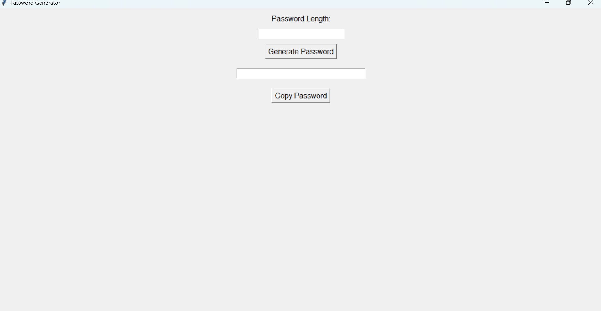

# Password Generator

## Screenshot

A Python GUI application that generates strong and secure random passwords.

## Features

* User-friendly graphical interface
* Custom password length selection
* Generates strong random passwords
* Copy password to clipboard with one click
* Fast and easy to use

## Technologies Used

* Python
* Tkinter
* Random Module

## How to Run

1. Install Python.
2. Run the Python file.
3. Enter the desired password length.
4. Click "Generate Password".
5. Copy the generated password using the "Copy Password" button.

## Author

Subrat Dubey
